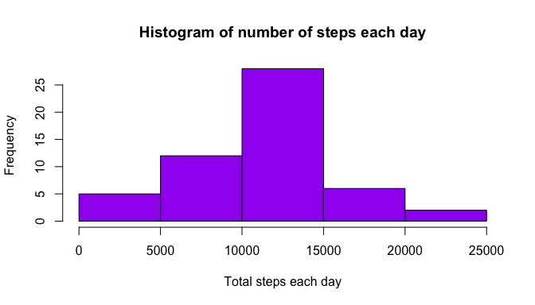
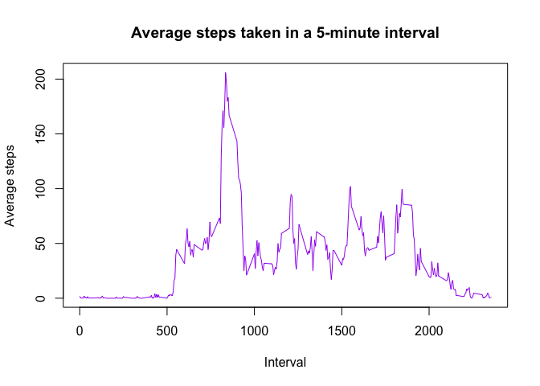

## Loading and preprocessing the data


```r
# Unzip and read csv data
activity <- unzip("activity.zip")
raw_data <- read.csv("activity.csv")
rm(activity)

# Primary clean-up: omit NA values and convert data variable to date format
data <- na.omit(raw_data)
date <- as.Date(data$date)
```


## What is mean total number of steps taken per day?

```r
# Daily steps
steps_day <- data %>% 
    group_by(date) %>% 
    summarize(total_steps=sum(steps))
```

```
## `summarise()` ungrouping output (override with `.groups` argument)
```

```r
# Graph daily data in an histogram
hist(x = steps_day$total_steps, 
     main = "Histogram of number of steps each day", 
     xlab = "Total steps each day", ylab = "Frequency",
     col = "purple")
```

<!-- -->

```r
# Descriptive statistics
mean_steps <- mean(steps_day$total_steps)
median_steps <- median(steps_day$total_steps)
```

The mean of total number of steps taken per day is 1.0766189\times 10^{4} and the median of total steps by day is 10765.

## What is the average daily activity pattern?

```r
#Data by 5 minutes-interval
interval <- as.numeric(data$interval)
five_av <- data %>% 
    group_by(interval) %>% 
    summarize(av_steps=mean(steps))
```

```
## `summarise()` ungrouping output (override with `.groups` argument)
```

```r
# Average activity time-series plot
plot(five_av$interval, five_av$av_steps, 
     main="Average steps taken in a 5-minute interval",
     type="l",
     xlab="Interval", ylab="Average steps",
     col = "purple")
```

<!-- -->

```r
# Interval with maximum number of steps
max <- five_av$interval[which.max(five_av$av_steps)]
```

The interval with the highest steps counted happened during 835.


## Imputing missing values

```r
# Calculate number of missing values
na <- sum(is.na(raw_data$steps))
```

There are 2304 data with NA values in the raw data.

## Are there differences in activity patterns between weekdays and weekends?

